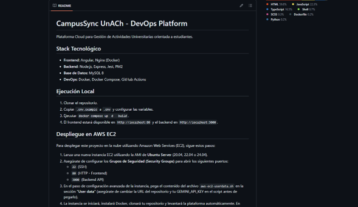
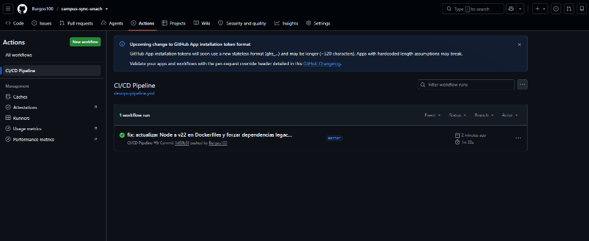
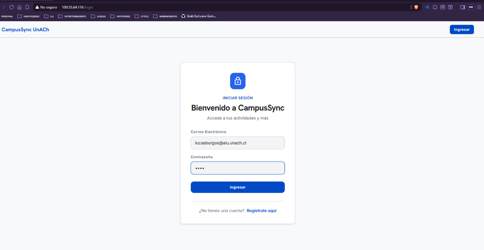
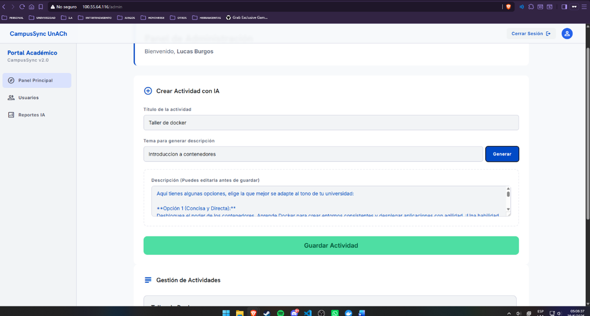
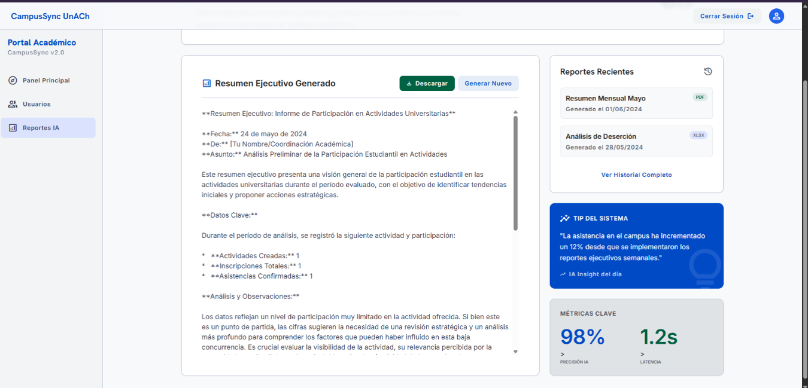

# CampusSync UnACh - DevOps Platform

Plataforma Cloud centralizada orientada a la Gestión de Actividades Universitarias.

## 1. Introducción
Las instituciones de educación superior se enfrentan constantemente al desafío de gestionar y coordinar un volumen masivo de actividades extracurriculares, académicas y administrativas. Frente a la dispersión de información, este proyecto implementa CampusSync, una Plataforma Cloud centralizada orientada a la Gestión de Actividades Universitarias.
Este documento detalla la arquitectura de desarrollo y el ciclo de vida del software (DevOps) implementado para CampusSync, asegurando entregas continuas, control de versiones, orquestación de contenedores y despliegue en la nube mediante AWS.

## 2. Descripción del Proyecto
CampusSync es una aplicación web moderna (Angular + Node.js/Express + MySQL) que permite administrar las actividades de la universidad con dos roles diferenciados: Administrador y Alumno.
- **Gestión de Usuarios:** Creación de cuentas, inicio de sesión seguro (con encriptación de contraseñas mediante bcryptjs) y cambio dinámico de roles en tiempo real.
- **Gestión de Actividades:** Los administradores pueden crear, modificar y eliminar actividades. Los alumnos pueden inscribirse a las actividades disponibles o visualizar sus inscripciones.
- **Asistencia:** Registro automático de participación y toggle de asistencia.
- **Asistencia de IA Generativa:** Se integró la API de Google Gemini (gemini-2.5-flash) que asiste a los coordinadores académicos de dos formas: generando descripciones atractivas automáticamente al momento de crear actividades, y creando Reportes Ejecutivos Globales procesando las métricas de asistencia y participación (con opción de descarga en archivo de texto).

## 3. Arquitectura DevOps
El flujo de trabajo se basa en las mejores prácticas de la industria para garantizar alta disponibilidad y control de versiones:
- **Control de Versiones (Git/GitHub):** Repositorio centralizado para el código fuente.
- **Continuous Integration (CI):** Uso de GitHub Actions para correr linters (ESLint), formateadores (Prettier) y pruebas automatizadas (Jest) tras cada push a la rama principal.
- **Continuous Deployment (CD):** Construcción automática de imágenes Docker.
- **Orquestación y Contenedores:** Docker y Docker Compose estructuran el frontend, backend y la base de datos de manera aislada.
- **Cloud (AWS):** Despliegue automatizado en una instancia EC2 de Amazon Web Services mediante scripts de User Data.

## 4. Docker y Docker Compose
La solución está completamente contenedorizada, eliminando el problema de "funciona en mi máquina".
- **Backend (Node.js):** Se construyó un Dockerfile basado en `node:18-alpine`. Instala las dependencias y utiliza PM2 (`pm2-runtime`) como gestor de procesos para mantener el servidor vivo y capturar logs básicos. Se expone en el puerto 3000.
- **Frontend (Angular):** Utiliza un Dockerfile multietapa (multi-stage). Primero compila la aplicación Angular para producción, y luego traslada los estáticos compilados a un servidor ligero Nginx (expuesto en el puerto 80).
- **Database (MySQL):** Se utiliza la imagen oficial `mysql:8`.
- **Docker Compose:** Orquesta los tres servicios definiendo dependencias (`depends_on: database`), mapeo de puertos y volúmenes (`db_data`) para la persistencia de datos.

## 5. Pipeline CI/CD (GitHub Actions)
Se implementó un flujo automatizado en el archivo `.github/workflows/devops-pipeline.yml`. Cuando se realiza un Push o Pull Request a la rama `main`, un runner de Ubuntu ejecuta:
1. **Checkout del código:** Clona el repositorio.
2. **Inyección de Secretos:** Construye dinámicamente un archivo `.env` extraído desde GitHub Secrets.
3. **Validación Backend:** Instala dependencias (`npm ci`), ejecuta reglas de calidad estática (`npm run lint`), y corre pruebas unitarias con Jest (`npm run test`).
4. **Validación Frontend:** Instala dependencias y valida código en Angular.
5. **Construcción (Build):** Ejecuta `docker-compose build` para asegurar que las imágenes Docker se puedan construir sin errores tras la actualización del código.

## 6. AWS (Infraestructura Cloud)
El despliegue se realiza sobre una máquina virtual Amazon EC2 (Ubuntu Server 22.04).
Se elaboró un script automatizado (`scripts/aws-ec2-userdata.sh`) que se inyecta en el campo User Data al momento de lanzar la instancia. Este script se encarga de:
1. Actualizar repositorios y paquetes de Ubuntu.
2. Instalar Docker y Docker Compose.
3. Clonar automáticamente el repositorio desde GitHub.
4. Generar el archivo `.env` de producción.
5. Ejecutar `docker-compose up -d --build` para levantar la plataforma y dejarla accesible a través de la IP Pública de la instancia EC2 por el puerto 80.

## 7. Seguridad
Se aplicaron múltiples capas de seguridad:
- **Variables de Entorno (.env):** Las credenciales de la Base de Datos y la API Key de Gemini nunca se suben directamente al código fuente (ignoradas en `.gitignore`).
- **GitHub Secrets:** En el pipeline de CI/CD, las credenciales sensibles se inyectan de forma encriptada sin exponerlas en los logs públicos de GitHub Actions.
- **Hashing de Contraseñas:** Integración de `bcryptjs` en el backend para evitar guardar contraseñas en texto plano.
- **Roles:** Restricciones de rutas en Frontend (Guards) y Backend validando el rol de Admin y Alumno.

## 8. Evidencias

A continuación, se presentan las evidencias del funcionamiento, despliegue y validación del proyecto:

## 9. Propuesta de Escalabilidad utilizando Kubernetes
Actualmente la arquitectura se basa en Docker Compose corriendo en un único nodo (instancia EC2). Para garantizar la alta disponibilidad y escalabilidad horizontal de la plataforma en un entorno de producción masivo (por ejemplo, durante la temporada de inscripción de talleres donde el tráfico es pico), se propone migrar a Kubernetes (Amazon EKS):
1. **Pods y Deployments:** Desplegar el Backend y Frontend en réplicas múltiples (Pods). Si la demanda aumenta, el Horizontal Pod Autoscaler (HPA) crearía nuevos pods dinámicamente.
2. **Servicios y Load Balancers:** Exponer la aplicación mediante un LoadBalancer de Kubernetes integrado con AWS ELB, distribuyendo el tráfico equitativamente entre los pods sanos del frontend.
3. **ConfigMaps y Secrets:** Migrar el archivo `.env` nativo a Secret objects dentro de Kubernetes para inyectar credenciales como la llave de Gemini directamente a nivel clúster.
4. **Almacenamiento:** Separar la base de datos hacia un servicio gestionado como Amazon RDS, o manejarla dentro del clúster con volúmenes persistentes y StatefulSets.

## 10. Conclusiones
El desarrollo de CampusSync demostró cómo las herramientas DevOps y la orquestación en la nube transforman radicalmente el ciclo de vida del software. La adopción de contenedores eliminó inconsistencias de ambiente, mientras que la Integración Continua garantizó que cualquier código defectuoso fuera detenido antes del despliegue. Además, la integración de IA Generativa sumó un valor funcional significativo a un problema real en el entorno académico, obteniendo como resultado un producto robusto, seguro y fácilmente mantenible.

---

### Ejecución Local Rápida

1. Clonar el repositorio.
2. Copiar `.env.example` a `.env` y configurar las variables.
3. Ejecutar `docker-compose up -d --build`.
4. El frontend estará disponible en `http://localhost:80` y el backend en `http://localhost:3000`.